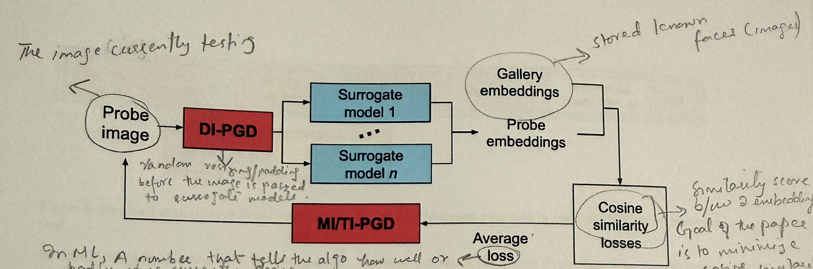

# FaceShield Paper Notes — Photo Protection Tool

---

## 1. Main Idea

FaceShield is designed to protect facial privacy in images.

The main goal is to create a protected version of a photo that:

- still looks normal and recognizable to humans
- is harder for face-recognition systems to identify
- can later be restored to the original image by an authorized user

The protected image is created using **adversarial perturbations**, which are small calculated changes to image pixels.

---

---

## 2. Image Processing

**Image processing** means using a computer to analyse or modify an image.

Examples include:

- resizing
- blurring
- edge detection
- changing brightness
- changing pixel values

FaceShield combines image processing with deep-learning face-recognition models.

---

## 3. Face Detection vs Face Recognition

### Face Detection

Face detection answers:

> Is there a face in this image and where is it? 

It usually returns a **bounding box** around the face.

### Face Recognition

Face recognition answers:

> Whose face is this?

or:

> Are these two faces of the same person?

FaceShield mainly tries to interfere with **face recognition**, not face detection.

A protected image can still contain a clearly visible face.

---

## 4. Face Embeddings

A face-recognition model converts a face into a numerical representation called a **face embedding**.

Example:

```text
[0.21, -0.45, 0.81, ...]
```

The embedding can contain hundreds of values. Faces of the same person should normally produce similar embeddings. Faces of different people should produce less similar embeddings.

---

## 5. Cosine Similarity

**Cosine similarity** is used to compare two embeddings.

In simple terms:

- high similarity → likely the same identity
- low similarity → less likely to be the same identity

FaceShield tries to reduce the similarity between:

- the original face embedding
- the protected face embedding

---

## 6. RetinaFace

FaceShield uses **RetinaFace** for face detection.

RetinaFace detects:

- the face location
- facial landmarks such as:
  - eyes
  - nose
  - mouth corners

These landmarks are used to prepare and align the face.

---

## 7. Face Alignment

Different photos may contain faces with different:

- positions
- angles
- sizes

**Face alignment** transforms the detected face so that important facial features are placed in standard positions.

The aligned face used by FaceShield is approximately:

```text
112 × 112 pixels
```

---

## 8. Adversarial Images

An **adversarial image** is an image that is intentionally modified so that a machine-learning model makes a mistake.

The changes are not random. They are calculated specifically to affect the AI model.

FaceShield creates a protected face by adding small adversarial changes to the original image.

---

## 9. Adversarial Perturbation

A **perturbation** is a small change added to an image.

Conceptually:

```text
Protected Image = Original Image + Perturbation
```

The perturbation should be small enough that the image still looks normal to a human.

---

## 10. PGD

FaceShield uses **Projected Gradient Descent (PGD)**.

PGD modifies the image repeatedly.

Basic idea:

1. Start with the original image.
2. Calculate which pixel changes would reduce face-recognition similarity.
3. Make a small update.
4. Repeat the process.
5. Keep the image within a limited distance from the original.

The result is the adversarial/protected image.

---

## 11. Gradient

A **gradient** tells the algorithm which direction it should change something.

In FaceShield, the gradient tells the algorithm:

> Which direction should the pixel values change to reduce face-recognition similarity?

The gradient is calculated from the loss produced by the recognition models.

---

## 12. Epsilon

Epsilon (`ε`) controls the **maximum allowed difference** between the original and protected image.

Larger epsilon:

- allows stronger changes
- may improve the attack
- may make changes more visible

Smaller epsilon:

- keeps the image closer to the original
- may reduce attack strength

---

## 13. Alpha

Alpha (`α`) is the **step size** used by PGD.

It controls how much the image changes during one iteration.

Difference:

- `ε` = maximum total allowed change
- `α` = size of one update step

---

## 14. Multiple Face-Recognition Models

FaceShield does not rely on only one face-recognition model.

It uses an ensemble of models:

- EdgeFace
- AdaFace
- InsightFace
- MobileFaceNet

The goal is to create an attack that is not specific to only one model.

---

## 15. Surrogate Models

A **surrogate model** is a model used to create the adversarial attack. The real target face-recognition system may be unknown. Therefore, FaceShield creates the attack using several known models and hopes that it will also affect other recognition systems.

---

## 16. Transferability

**Transferability** means that an adversarial image created against one or more models can also fool another model that was not directly used during attack generation.

Using multiple surrogate models is intended to improve transferability.

---

## 17. MI-PGD

**MI** stands for **Momentum Iterative PGD**. Momentum remembers previous gradient directions. Instead of allowing the optimization direction to change too sharply at each step, momentum makes the attack direction more stable.

Simple idea:

```text
MI = remember previous gradient direction
```

---

## 18. DI-PGD

**DI** stands for **Diverse Input PGD**. During attack generation, the input image may be randomly:

- resized
- padded
- slightly repositioned

This prevents the attack from depending on one exact image arrangement.


---

## 19. TI-PGD

**TI** stands for **Translation-Invariant PGD**. It tries to make the attack less dependent on exact pixel positions. This helps the perturbation remain useful even if the face is shifted slightly.

---

# Figure 2 — Adversarial Attack Flow



The figure shows the main optimization loop used to create the protected face.

It is easiest to understand from **left to right**.

---

## 20. Probe Image

The **probe image** is the face image currently being tested or modified.

In FaceShield:

```text
Uploaded image
    ↓
Face detected
    ↓
Face aligned
    ↓
112 × 112 face
    ↓
Probe image
```
---

## 21. Gallery Embeddings

A face-recognition system normally has stored face representations for known identities. These stored representations are called **gallery embeddings**.

Conceptually:

```text
Known Person A → stored embedding
Known Person B → stored embedding
Known Person C → stored embedding
```

The probe embedding can then be compared against these stored embeddings. In FaceShield's optimization, the protected/probe face embedding is compared with the original/gallery embedding.

---

## 22. DI-PGD in Figure 2

The probe image first passes through **DI-PGD**. DI-PGD randomly applies small transformations such as resizing or padding.

Why?

Because FaceShield does not want the adversarial attack to work only for one exact image arrangement.

Conceptually:

```text
Probe image
    ↓
slight random resize / padding
    ↓
send to recognition models
```

---

## 23. Surrogate Models in Figure 2

The transformed probe image is passed through several **surrogate face-recognition models**.

The paper uses:

- EdgeFace
- AdaFace
- InsightFace
- MobileFaceNet

Each model converts the current face into a **probe embedding**.

Conceptually:

```text
Current face
    ↓
Face-recognition model
    ↓
Probe embedding
```

The same process happens for all surrogate models.

---

## 24. Probe Embeddings vs Gallery Embeddings

For each model, FaceShield has:

```text
Original face
    ↓
Gallery/original embedding
```

and:

```text
Current adversarial face
    ↓
Probe embedding
```

The algorithm compares these two representations. The goal is to make the probe embedding less similar to the original/gallery embedding.

---

## 25. Cosine Similarity Loss

The figure sends the:

- probe embeddings
- gallery embeddings

into the **cosine similarity loss** calculation. Cosine similarity tells the system how similar the two face representations are.

In simple terms:

```text
High similarity
→ model still thinks they are the same person
```

```text
Lower similarity
→ model is becoming less confident they are the same identity
```

FaceShield wants to reduce this similarity.

---

## 26. Average Loss

Because FaceShield uses several surrogate models, each one contributes its own loss. The losses are combined by averaging them.

> FaceShield tries to find pixel changes that work across several models, instead of overfitting to only one model.

---

## 27. Gradient from the Loss

After calculating the loss, FaceShield calculates a **gradient**.

The gradient tells the algorithm:

> Which direction should the pixels change so that face-recognition similarity decreases?

The flow is:

```text
Current face
    ↓
Recognition models
    ↓
Embeddings
    ↓
Similarity / loss
    ↓
Gradient
    ↓
Pixel update
```

---

## 28. Where MI-PGD and TI-PGD Fit

Figure 2 also shows **MI/TI-PGD** in the update loop.

A simplified view is:

```text
Current image
    ↓
DI:
randomly transform input
    ↓
Surrogate recognition models
    ↓
Loss
    ↓
Gradient
    ↓
TI:
make gradient less dependent on exact position
    ↓
MI:
combine with previous gradient direction
    ↓
PGD pixel update
    ↓
Clip to epsilon limit
    ↓
Repeat
```

So:

- **DI** acts on the input
- **TI** acts on the gradient spatially
- **MI** adds momentum from previous iterations

---

## 29. Iterative Optimization

The attack is iterative. That means the whole process repeats many times.

Example:

```text
Iteration 1
Current face
→ models
→ loss
→ gradient
→ pixel update

Iteration 2
Updated face
→ models
→ loss
→ gradient
→ pixel update

Iteration 3
Updated face again
→ ...
```

The protected image gradually becomes harder for the face-recognition models to match.

---

## 30. Sobel Edge Detection and Face Mask

FaceShield also controls **where** the adversarial changes are applied.

### Sobel Edge Detection

The **Sobel operator** detects areas where pixel values change quickly.

Examples of facial edges include:

- eyes
- eyebrows
- nose boundaries
- lips
- jawline
- hairline

Small changes can be easier to hide in these detailed/high-frequency regions than on smooth skin.

### Elliptical Face Mask

A mask tells the program which parts of the image should be affected.

FaceShield uses an elliptical mask around the face to:

- keep the attack focused on the facial area
- avoid unnecessary changes in the background

The Sobel edge mask and face mask are combined so that perturbations mainly affect useful facial structures.

---

## 31. Putting the Protected Face Back Into the Image

The adversarial optimization mainly works on the aligned:

```text
112 × 112
```

face.

After the protected face is created:

1. it is transformed back to the original face position
2. it is placed back into the full-resolution image
3. the face-mask boundary is smoothed/blended

Blending is important because otherwise the altered face could look like a visible square pasted onto the photograph.

---

# Complete Photo Protection Tool Flow

The whole Photo Protection Tool can be summarized as:

```text
Normal photograph
    ↓
RetinaFace detects face and landmarks
    ↓
Face alignment
    ↓
112 × 112 probe face
    ↓
DI-PGD transformation
    ↓
Multiple surrogate recognition models
    ↓
Probe embeddings
    ↓
Compare with original/gallery embeddings
    ↓
Cosine similarity losses
    ↓
Average loss
    ↓
Gradient calculation
    ↓
TI + MI processing
    ↓
PGD pixel update
    ↓
Clip to epsilon limit
    ↓
Repeat optimization
    ↓
Apply Sobel/face masking
    ↓
Transform protected face back
    ↓
Blend with original full-resolution image
    ↓
Protected photograph
```
---
# Photo Recovery Tool

---

## 32. What the Recovery Tool Does

After FaceShield protects a photo, the image is no longer exactly the same as the original.The Recovery Tool is used to reconstruct the original photo from the protected FaceShield image.

---

## 33. What Is the Delta Image?

The Delta image stores the difference between:

- the original image
- the adversarial/protected image

The paper defines it as:

```text
I_delta = (I_original - I_adversarial) + 128
```
---

Suppose one original pixel has the value:

```text
100
```

After FaceShield protection, it becomes:

```text
105
```

The real difference is:

```text
100 - 105 = -5
```

So if we later know:

```text
Protected value = 105
Difference = -5
```

we can recover the original:

```text
105 + (-5) = 100
```

This same idea is applied across the image.

---

## 34. Why Does the Paper Add 128?

Normal 8-bit image values are usually stored in the range:

```text
0 to 255
```

But pixel differences can be negative.

For example:

```text
100 - 105 = -5
```

A negative value like `-5` cannot be directly stored in a normal unsigned 8-bit image value.

So FaceShield shifts the difference by adding 128:

```text
-5 + 128 = 123
```

Now the value fits inside the normal range.

```text
0 ----------- 128 ----------- 255
               |
          no difference
```

- below 128 → negative difference
- exactly 128 → no difference
- above 128 → positive difference

---

## 35. Why Is the Delta Stored as PNG?

The Delta needs to preserve exact values. PNG is used because it supports **lossless** storage.

### Lossy compression

Lossy formats such as JPEG may slightly change image data to reduce file size. That is fine for normal photographs but not for recovery data.

For example, if the correct Delta value is:

```text
123
```

and compression changes it to:

```text
121
```

the recovered pixel would be wrong.

---

## 36. Why the Delta Must Be Encrypted

The Delta contains enough information to recover the original image.

If FaceShield simply stored the Delta openly, anyone who had:

```text
Protected image
+
Delta image
```

could reconstruct the original. That would defeat the privacy protection. So the Delta/recovery information is encrypted.

The paper uses:

```text
AES-256-GCM
```
---

## 37. Where Is the Recovery Information Stored?

FaceShield does not require a separate recovery file. Instead, the encrypted recovery information is stored inside the same JPEG file as the protected image.

Conceptually:

```text
FaceShield JPEG
│
├── Protected image
│
└── Encrypted recovery information
```

A normal image viewer still displays the protected JPEG normally. FaceShield's Recovery Tool can also read the extra recovery information stored in the file.

---

## 38. JPEG APP11 Segments

A JPEG file contains different internal sections called segments. Some of these are application-specific segments.

FaceShield uses:

```text
APP11
```

segments to store the encrypted recovery payload. So the file contains normal JPEG image data plus additional FaceShield data.

---

There Can Be Multiple APP11 Segments. The encrypted recovery payload may be too large for one JPEG APP11 segment.

So FaceShield can split it into several chunks.

```text
Encrypted recovery payload
        ↓
split into chunks
        ↓
APP11 part 1
APP11 part 2
APP11 part 3
...
```

The chunks contain information that allows them to be put back in the correct order during recovery.

---

## 39. What the Recovery Tool Receives

The Recovery Tool starts with a FaceShield JPEG.

The file already contains:

```text
1. Protected image
2. Encrypted recovery payload
```

The tool then reads the JPEG structure and looks for the FaceShield APP11 data.

---

The recovery process can be understood as:

```text
FaceShield JPEG
      ↓
Find APP11 recovery data
      ↓
Reconstruct encrypted payload
      ↓
Obtain the correct decryption key
      ↓
Decrypt recovery data
      ↓
Recover Delta image
      ↓
Use Delta + protected image
      ↓
Recover original image
```

---

## 40. Recovery Equation

The paper uses:

```text
I_original = I_adversarial + (I_delta - 128)
```

This is the reverse of the Delta creation process.

The `-128` is important because the Delta was stored with a `+128` offset.

Suppose:

```text
Original pixel = 100
Protected pixel = 105
```
paper's recovery equation:

```text
105 + (123 - 128)
= 105 + (-5)
= 100
```

The original value is recovered exactly.

---

The same idea is applied across the image's pixel values. For a colour pixel, the process is applied to the colour channels.

For example:

```text
Original RGB:
[150, 120, 90]

Protected RGB:
[153, 118, 92]
```

The differences are:

```text
Red:   150 - 153 = -3
Green: 120 - 118 =  2
Blue:   90 - 92  = -2
```

These differences are stored with the +128 offset and later reversed during recovery.

---

