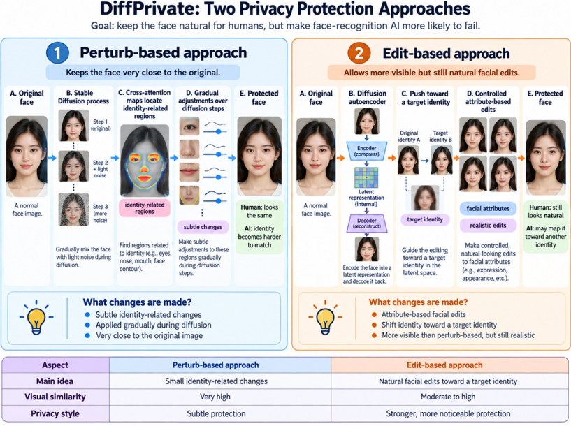

# Paper Notes: DiffPrivate — Facial Privacy Protection with Diffusion Models

## Overview

DiffPrivate proposes **two different ways to protect a face** from face-recognition systems while keeping the resulting image natural-looking to humans.

<p align="center">
  
</p>

---

## 1. Two Privacy Protection Approaches

### Perturb-based mode

- Keeps the photo looking **very close to the original**.
- Makes subtle changes that affect face recognition.

### Edit-based mode

- Makes slightly more visible facial changes while keeping the image natural.
- Example attributes that can change include:
  - eyebrows
  - lip appearance
  - cheek shape
  - smile
  - hair-related appearance
- The goal is **not** to completely change the person into someone else. Instead, the method moves the face enough that the face-recognition system becomes confused.

---

## 2. How the Edit-based Approach Uses a Target Identity

In the Edit-based DiffPrivate approach, the **target image is a separate face image**. The system uses the identity information from that face as the direction in which the original identity should be pushed.

The paper describes both an **original face** and a **target face**, and combines their internal representations during optimization.

### Simplified pipeline

```text
  photo
   ↓
Original identity = A

Separate target face
   ↓
Target identity = B

The method mixes/adjusts A toward B
   ↓
Protected image
```

### Important point about the target face

The target is **not automatically stored inside the model as one fixed universal face**.

In the paper's Edit-based algorithm, a target identity representation is an input to the process. In a real application, this could theoretically be handled in several ways:

- The user provides a target face.
- The app automatically selects a target from an available pool.
- The developer preselects targets behind the scenes.

The paper describes the **method**, not a finished consumer-app workflow. It assumes that a target identity is available to the algorithm.

### Does the target need to change for every photo?

Not necessarily. The same target identity could be used for multiple input photos. However, if many protected images are pushed toward the same target, they may become more consistently associated with that target by the recognition system. The paper's goal is specifically to make protected images map toward another targeted identity, partly so that they can pollute or confuse a facial-recognition database.

---

## Q1. What is their main idea?

They use a type of image-generating AI called a **diffusion model**.

A diffusion model is good at gradually creating or editing realistic images. Instead of adding obvious random noise to a face, DiffPrivate uses this image-generation process to carefully alter features related to identity while trying to keep the image realistic.

---

## Q2. Why do they need two approaches?

Because there is a **trade-off between visual similarity and privacy protection**.

```text
More similar to original  ←────────────→  Stronger privacy
```

- If the face is changed very little, it looks almost identical to the original, but privacy protection may be weaker.
- If the face is changed more, privacy protection may improve, but the result looks less like the original.

The two approaches explore different points on this trade-off.

---

## Q3. What did they test?

The authors tested whether the protected faces could:

- fool face-recognition systems,
- maintain good image quality,
- and work against recognition models other than the one used during creation.

That last property is called **transferability**.

They report competitive results for both attack success and transferability, and found that their protected images looked more natural than several older methods.

---

## Q4. What is their main strength?

The main strength is that DiffPrivate produces **more natural-looking protected faces** than many older privacy methods.

Older approaches can introduce visible noise or strange artifacts. DiffPrivate tries to avoid that by using diffusion models, which are better at generating realistic-looking faces.

---

## Q5. What are the weaknesses?

### 1. An attacker may learn how to undo the protection

Suppose an application creates protected images using DiffPrivate and an attacker knows exactly how the method works. The attacker could potentially train another AI system to recognize that an image has been modified using DiffPrivate and then try to reverse or compensate for those changes. The authors explicitly note that adversarial methods like this can be vulnerable to advanced attackers who know the method and train reverse models against it.

### 2. It depends heavily on the diffusion model

DiffPrivate relies on **Stable Diffusion** to rebuild high-quality images.

If the underlying diffusion model produces problems such as:

- bad eyes,
- odd skin,
- incorrect hair,
- or biased facial reconstruction,

then DiffPrivate can inherit those problems. The authors state that the protection quality depends on the underlying generative model. They also mention that demographic biases in the model could affect how consistently the privacy protection works across different people.

In short, **DiffPrivate is only as good as the image generator underneath it**.

### 3. It needs a lot of computing power

This is one of the most relevant practical weaknesses.

Diffusion models are computationally heavy and typically require:

- a powerful GPU,
- significant memory,
- and multiple processing steps.

DiffPrivate does not perform just one simple image operation. It repeatedly runs a large neural network while rebuilding the image.

The authors explicitly list **computational efficiency** as a limitation and note that heavy diffusion models may make the method inaccessible to users with weaker hardware.

---
